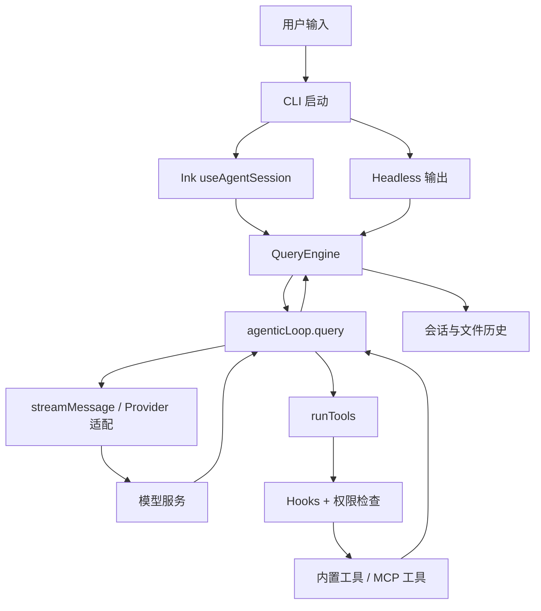

# 架构总览

## 项目定位与技术栈

Easy Agent 是单包的终端 Coding Agent：Node.js 22+、ESM、严格 TypeScript、React 19 + Ink 7。`package.json` 将 `eagent` 和 `easy-agent` 两个命令指向打包后的 `dist/eagent.js`。`step/` 保存阶段教学代码，`src/` 才是产品实现；不要从快照推断当前行为。

仓库按职责可以看成五层：

| 层 | 关键位置 | 职责 |
| --- | --- | --- |
| 入口与界面 | [CLI](../../src/entrypoint/cli.ts)、[Headless](../../src/entrypoint/headless.ts)、[Ink 会话 Hook](../../src/ui/hooks/useAgentSession.ts) | 参数、启动、交互渲染和机器可读输出 |
| 会话编排 | [QueryEngine](../../src/core/queryEngine.ts)、[命令处理](../../src/core/queryEngine/commands/)、[会话存储](../../src/session/storage.ts) | 输入分类、斜杠命令、上下文与用量、恢复 |
| Agent 循环 | [agenticLoop](../../src/core/agenticLoop.ts) | 多轮模型调用、工具调度、事件与终止条件 |
| 工具与边界 | [工具注册表](../../src/tools/index.ts)、[权限](../../src/permissions/permissions.ts)、[路径](../../src/tools/pathUtils.ts)、[沙箱](../../src/sandbox/) | 工具执行、Allow/Ask/Deny、路径与进程隔离 |
| 模型通信 | [流式入口](../../src/services/api/streaming.ts)、[模型 Profile](../../src/services/api/providers/profile.ts)、[Provider 适配](../../src/services/api/providers/) | 把不同协议的请求和流事件接到统一的上层接口 |

`src/agents/`、`src/services/mcp/`、`src/services/skills/`、`src/plugins/` 分别扩展 Agent、外部工具、提示能力和插件资源；它们并非绕开上述主线。

## 启动时装配什么

在 [`cli.ts`](../../src/entrypoint/cli.ts) 中，先处理工作区可信状态与配置，再装配 Skills、Agents、输出样式、自定义命令和插件。这些内容会影响首轮系统提示或命令列表，因此在界面渲染前加载。MCP 连接随后在后台启动：注册表先显示 pending，连接成功后刷新全局工具列表；若用户在连接完成前发起请求，那一轮可能还看不到对应 MCP 工具。

交互模式首次进入陌生项目会询问信任。Headless 不弹框，会忽略未受信任项目中的敏感配置；详见[配置可信边界](../../docs/configuration-security.md)。阅读配置问题时，应同时检查“配置写在哪里”和“项目是否已受信任”。

## 两条入口，一套引擎

- 交互模式：Ink 的 [`useAgentSession`](../../src/ui/hooks/useAgentSession.ts) 创建 `QueryEngine`，消费其事件更新消息列表、权限卡片和工具状态。
- Headless 模式：[`runHeadless`](../../src/entrypoint/headless.ts) 创建相同的 `QueryEngine`，把事件转换为文本、JSON 或 NDJSON。无交互权限询问时，待确认的操作默认拒绝。

这使模型和工具逻辑可以复用，但 UI 和 Headless 对同一事件的处理需要保持一致。增添新事件时，应检查两个消费者，以及[事件相关测试](../../src/scripts/test-cli-headless-characterization.ts)。

## 配置与模型适配

[`profile.ts`](../../src/services/api/providers/profile.ts) 把用户可见的模型 handle 解析为协议、模型名、端点和凭证。命中 `models` Profile 时走声明的协议；未命中时按原始 Anthropic 模型名处理。因此设置环境变量 `OPENAI_API_KEY` 本身不会把默认模型切到 GPT，还要有 Profile 或显式的 `--model` 选择。

Provider 层分别处理 Anthropic、OpenAI Chat/Responses、Gemini 的请求与流事件；上层仍消费统一的事件形状。这是可扩展点，也是兼容风险集中处：工具调用 ID、流式分块、停止原因、usage 与错误重试都需要跨协议验证。

## 关键设计取舍

1. **事件流复用**：同一 `QueryEngine` 支撑 TUI 和 Headless，适合以后接脚本或服务接口。
2. **读工具可并发**：[`agenticLoop.ts`](../../src/core/agenticLoop.ts) 把连续、标记为并发安全的工具调用分批执行，最多并发 10 个；写文件和 Shell 等保持顺序，并按模型发起的顺序回填结果。
3. **功能密度高**：会话、权限、Hooks、团队、插件都挂在主调用链上，学习时应先跑通最小闭环，再扩到某个子系统。
4. **可信边界分层**：项目配置可信判断、工具权限、路径检查、宿主沙箱解决的问题不同；做安全改动时不能只看其中一层。

下一步沿[核心调用链](./0001-2026-09-26-参考-核心调用链.md)逐行追踪一次工具调用。
